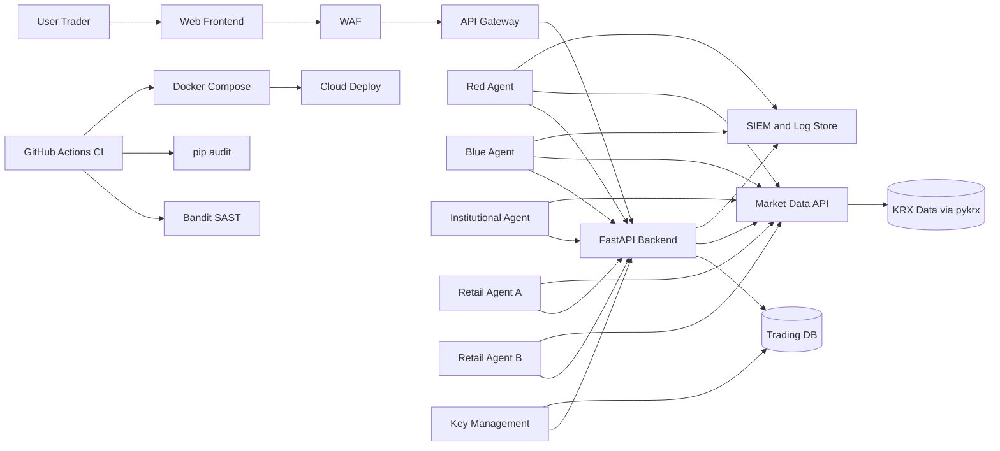
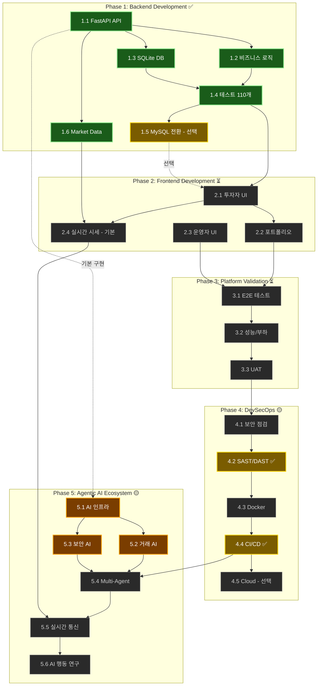
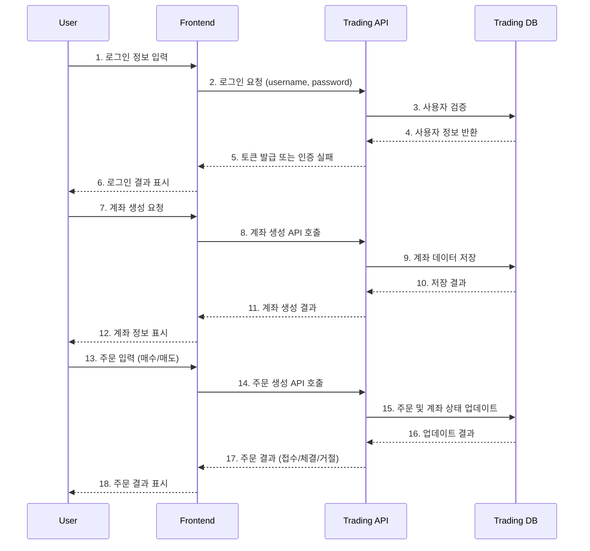
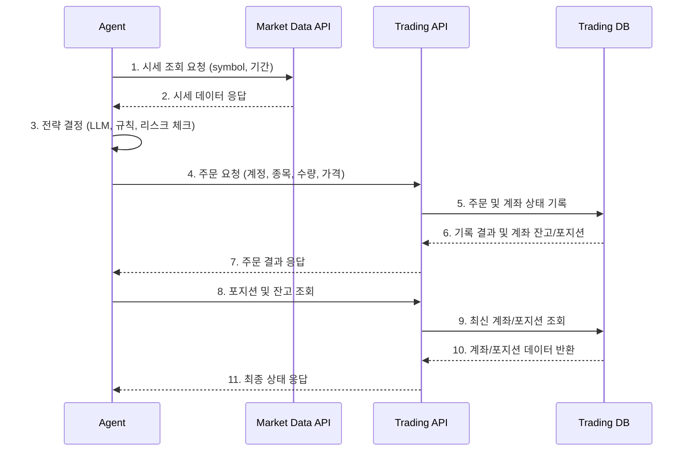
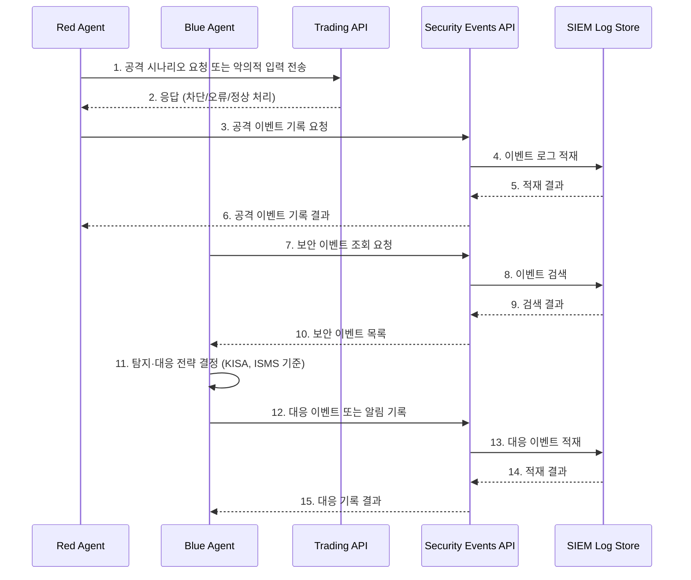
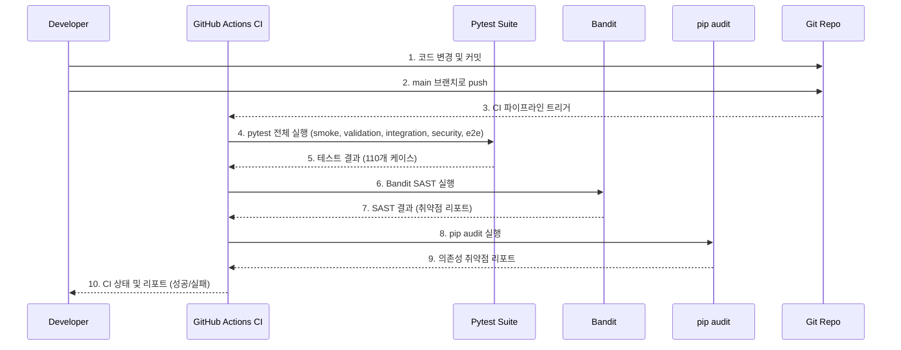
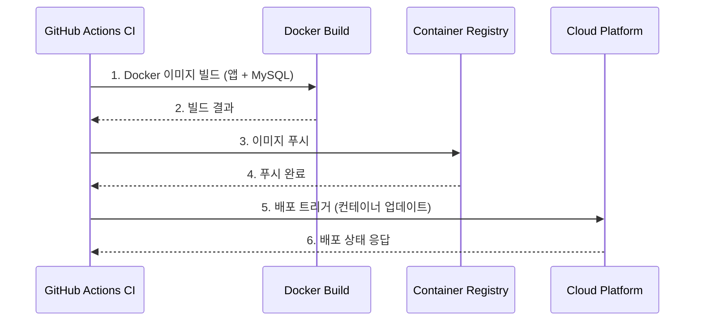
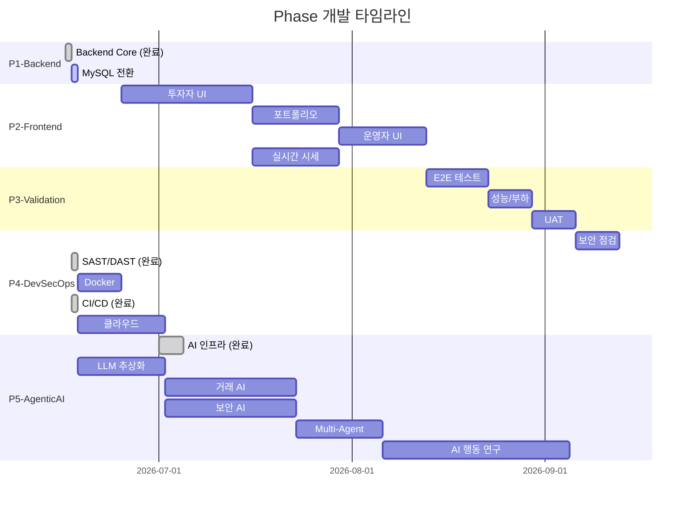

# DevSecOps Trading Platform Lab with Agentic AI

우리는 진보하는 AI기반 사이버공격에 대한 두려움과 경각심을 가지고 있습니다. 안전하고 신뢰성 있는 **"모의 증권거래 플랫폼"**을 구현하면서 DevSecOps with Agentic AI 거버넌스를 조성하고 Agentic AI의 행동 연구를 수행하고자 추진된 개인 프로젝트입니다.

> ⚠️ **면책조항**
> 본 프로젝트는 교육 및 역량강화 목적입니다. 사이버 범죄 영감 획득, 악성 행위 활용 등은 국내외 법에 따른 처벌 대상이며, 프로젝트 작성자는 책임을 지지 않습니다.

---

## 📋 진행 현황 (Progress)

| Phase | 핵심 목표 | 상태 | 완성 기준 |
|-------|-----------|------|-----------|
| **Phase 1** | Backend Development | ✅ **100%** | 인간이 API로 거래 가능 |
| **Phase 2** | Frontend Development | ⏳ 대기 | 인간이 UI로 거래 및 운영 가능 |
| **Phase 3** | Platform Validation | ⏳ 대기 | 안정적 운영 확인 |
| **Phase 4** | DevSecOps | 🟡 **60%** | 배포 준비 완료 |
| **Phase 5** | Agentic AI Ecosystem | 🟡 **20%** | AI 간 자율 상호작용 |

---

## ⚡ Quick Start

### 1. 저장소 클론
```bash
git clone https://github.com/phantomITer/devsecops-trading-platform-lab-with-agentic-ai.git
cd devsecops-trading-platform-lab-with-agentic-ai
```

### 2. 가상환경 설정
```bash
python -m venv venv

# Windows
.\venv\Scripts\activate

# macOS/Linux
source venv/bin/activate
```

### 3. 의존성 설치
```bash
pip install -r requirements.txt
```

### 4. 데이터베이스 선택

#### 옵션 A: SQLite (개발용, 기본)
```bash
echo "DB_TYPE=sqlite" > .env
python -c "from app.database import init_db; init_db()"
uvicorn app.main:app --reload
# uvicorn app.main:app --reload --host 0.0.0.0 --port 8000
```


#### 옵션 B: MySQL (프로덕션, 선택)
```bash
# Docker MySQL 시작
docker exec -it trading-platform-mysql mysql -u trading_user -p
# 비밀번호로 trading_pass 입력
SHOW DATABASES;

# .env 파일 생성
cat > .env << EOF
DB_TYPE=mysql
DB_HOST=10.10.10.10      # 또는 rocky01 NAT IP
DB_PORT=3306
DB_NAME=trading_platform
DB_USER=trading_user
DB_PASS=trading_pass
EOF

```bash
docker run -d \
  --name trading-platform-mysql \
  -e MYSQL_ROOT_PASSWORD=RootPass123! \
  -e MYSQL_DATABASE=trading_platform \
  -e MYSQL_USER=trading_user \
  -e MYSQL_PASSWORD=trading_pass \
  -p 3306:3306 \
  --restart unless-stopped \
  mysql:8


# 테이블 생성
python -c "from app.database import init_db; init_db()"
```

### 5. Frontend 준비 (Phase 2)

#### 5-1. React 프로젝트 생성

```bash
# 프로젝트 루트에서 (이미 appfrontend가 있다면 이 단계는 생략)
mkdir -p appfrontend
cd appfrontend

# React 18 + TypeScript SPA (Vite 예시)
npm create vite@latest . -- --template react-ts

# 기본 의존성 설치
npm install
npm install axios react-router-dom
```

> 현재 UI 스타일링은 기본 CSS/레이아웃 위주로 진행 중이며,  
> Tailwind CSS 및 추가 UI 라이브러리는 Phase 2 진행 상황에 따라 도입 예정이다.

#### 5-2. Backend 연동 기본 설정

```ts
// appfrontend/src/api/client.ts
import axios from "axios";

const api = axios.create({
  baseURL: "http://localhost:8000/api/v1",
});

export async function getMarketData(symbol: string) {
  const res = await api.get(`/market-data/${symbol}`);
  return res.data;
}

export async function getOrders() {
  const res = await api.get("/orders/");
  return res.data;
}

export async function getPositions() {
  const res = await api.get("/positions/");
  return res.data;
}

export async function createOrder(payload: {
  account_id: number;
  symbol: string;
  side: "BUY" | "SELL";
  order_type: "LIMIT" | "MARKET";
  price: number;
  quantity: number;
}) {
  const res = await api.post("/orders/", payload);
  return res.data;
}
```

#### 5-3. Frontend 개발 서버 실행

```bash
# 프로젝트 루트/appfrontend 디렉터리에서
npm run dev
```

- Backend (FastAPI): `http://localhost:8000`
- Frontend (Vite): `http://localhost:5173`


### 6. 서버 실행
```bash
uvicorn app.main:app --reload
# uvicorn app.main:app --reload --host 0.0.0.0 --port 8000
```

### 7. 동작 확인

| 항목 | URL |
|------|-----|
| Swagger UI | http://localhost:8000/docs |
| ReDoc | http://localhost:8000/redoc |
| Health Check | http://localhost:8000/api/v1/health |

### 8. 테스트 실행
```bash
# 전체 테스트
pytest tests/ -v

# 카테고리별
pytest tests/smoke/ -v
pytest tests/validation/ -v
pytest tests/integration/ -v
pytest tests/security/ -v
pytest tests/e2e/ -v
pytest tests/test_phase2_agents.py -v
pytest tests/test_v1.py -v
```


---

## 🎯 프로젝트 아키텍처

### 1. 모의 증권거래 플랫폼 구성

| 레이어 | Agentic AI | 역할 | 전략/기능 |
|--------|------------|------|-----------|
| **👥 거래 참여자** | 🏦 InstitutionalAgent | 기관투자자 | 블록 거래, TWAP/VWAP 전략 |
| | 👤 RetailAgentA | 개인투자자 A | 가치투자 (Buy-the-Dip) |
| | 👤 RetailAgentB | 개인투자자 B | 모멘텀 (FOMO Trading) |
| **🛡️ 보안 레이어** | 🔵 BlueAgent | Agentic AI 방어자 | 위협 탐지, KISA 가이드 기반 대응 |
| | 🔴 RedAgent | Agentic AI 공격자 | OWASP Top 10 공격 |

### 2. 개발 철학

- **Phase 1~4**: 인간이 사용하는 완전한 거래 플랫폼 구축
- **Phase 5**: Agentic AI가 인간을 대체하여 플랫폼에서 자율 생활 및 상호작용 연구

---

### 3. System Architecture




### 4. 🔄 Phase 의존성 그래프



### 5. flow sequence
5.1 인간 사용자 트레이딩 플로우 (로그인 → 계좌 → 주문 → 체결)


5.2 Agentic AI 기반 자동매매 플로우 (시세 조회 → 전략 → 주문 → 포지션 확인)


5.3  Red / Blue Security Agentic AI 플로우 (공격 시뮬레이션 ↔ 탐지/대응)


5.4 보안 테스트 플로우 (OWASP Top 10, Validation, Integration, E2E)


5.5 배포 플로우 (CI → Docker → Cloud)


---

## 🗺️ 상세 Roadmap

### 📊 예상 일정 요약



### ✅ Phase 1: Backend Development (100% 완료)

**목표**: 거래 플랫폼 서버 구축 — 인간이 API로 거래 가능

| 항목 | 상태 | 설명 |
|------|------|------|
| 1.1 FastAPI REST API | ✅ 완료 | 주문/계좌/포지션/시세 API |
| 1.2 비즈니스 로직 | ✅ 완료 | 주문 체결, 잔고 검증 |
| 1.3 Database (SQLite) | ✅ 완료 | 로컬 개발 환경 |
| 1.4 Unit/Integration 테스트 | ✅ 완료 | 110개 테스트 통과 |
| 1.5 Database (MySQL) *(선택)* | 🔄 진행 중 | 프로덕션 DB 준비 |
| 1.6 Market Data 연동 | ✅ 완료 | pykrx 실시간 시세 |

---

### ⏳ Phase 2: Frontend Development (대기)

**목표**: 인간 사용자 인터페이스 — 인간이 UI로 거래 가능

| 항목 | 상태 | 설명 |
|------|------|------|
| 2.1 투자자 거래 UI | ⏳ 대기 | 주문 생성/조회/취소 (스코프 정의 완료, 구현 대기) |
| 2.2 포트폴리오 대시보드 | ⏳ 대기 | 보유 자산, 손익 현황 |
| 2.3 운영자 모니터링 UI | ⏳ 대기 | 전체 시스템 관리 |
| 2.4 실시간 시세 *(기본)* | ⏳ 대기 | WebSocket + 차트 |


#### 2.1 Frontend Phase 2 현재 범위

현재 프론트엔드 구현은 다음 범위를 우선 목표로 한다.

- 로그인 및 JWT 인증 연동
- 메인 거래 화면 UI 구축
- 시세 조회 기능
- 주문 입력 및 주문 생성 API 연동
- 주문내역 조회
- 포지션 조회 및 **계좌별 필터링 렌더링**
- 로딩/에러 상태 처리
- WebSocket 기반 실시간 시세 반영(가능 범위 내 우선 적용)

#### 2.2 현재 거래 모델 정책

현재 단계에서는 플랫폼 전체 흐름을 빠르게 검증하기 위해 **단순 체결 모델**을 우선 적용한다.

- 주문 생성 시 즉시 체결된 것으로 간주할 수 있다.
- 포지션은 주문 결과에 따라 생성 또는 갱신된다.
- 이 단계에서는 별도의 체결 테이블이나 정교한 호가 매칭 엔진을 필수 범위로 두지 않는다.

이 정책은 프론트엔드/백엔드 연동과 기본 거래 흐름 검증을 위한 MVP 목적에 맞춘 것이다.

#### 2.3 향후 시장 시뮬레이션 확장

이후 단계에서는 시장 미시구조를 반영하는 정교한 거래 시뮬레이션으로 확장한다.

- order book(호가창) 도입
- executions / fills 테이블 추가
- price-time priority 기반 매칭 엔진 구현
- 부분 체결 및 잔량 주문 상태 관리
- 체결 누적 기반 포지션 계산
- 기관 agent / 개미 agent / 기타 agent 간 상호작용 거래 시뮬레이션

#### 2.4 포지션 데이터 메모

`positions` 데이터는 계좌별 현재 보유 종목 상태를 의미한다.

예시 필드:

- `account_id`
- `symbol`
- `quantity`
- `avg_price`
- `updated_at`

- 포지션은 주문 그 자체가 아니라, 실제 거래 결과(또는 현재 단계에서는 단순 체결 정책에 따른 결과)를 반영한 잔고 상태다.
---

### ⏳ Phase 3: Platform Validation (대기)

**목표**: 플랫폼 완성도 검증 — 안정적 운영 확인

| 항목 | 상태 | 설명 |
|------|------|------|
| 3.1 E2E 테스트 | ⏳ 대기 | 전체 거래 시나리오 (회원가입 → 거래 → 결산) |
| 3.2 성능/부하 테스트 | ⏳ 대기 | 동시성, 처리량 검증 |
| 3.3 사용자 수용 테스트 | ⏳ 대기 | 실제 사용 시나리오 검증 |

---

### 🟡 Phase 4: DevSecOps (60% 완료)
**목표**: 안전한 운영 환경 — 배포 준비 완료

| 항목 | 상태 | 설명 |
|------|------|------|
| 4.1 보안 점검 및 보완 | ⏳ 대기 | 취약점 스캔, 기존 보안 강화 검토 |
| 4.2 보안 스캔 자동화 | ✅ 완료 | SAST/DAST (Bandit, Dependency 취약점 스캔) |
| 4.3 컨테이너화 | ⏳ 대기 | Docker + docker-compose |
| 4.4 CI/CD 파이프라인 | ✅ 완료 | GitHub Actions 자동화 |
| 4.5 클라우드 배포 *(선택)* | ⏳ 대기 | Azure/AWS 운영 환경 |

---

### 🟡 Phase 5: Agentic AI Ecosystem (20% 완료)

#### **5.1 목표**: Agentic AI 생태계 — AI 간 자율 상호작용

> **핵심 개념**: Phase 1~4에서 구축된 플랫폼 위에서 5개의 Agentic AI가 인간을 대체하여 자율적으로 활동합니다. 기관투자자, 개인투자자, 보안 공격자, 보안 방어자가 원래 인간이어야 할 역할이지만, AI가 이 플랫폼 속에서 상호작용하며 마치 실제 인간 세계처럼 행동합니다. 이 과정에서 AI 간 행동 패턴, 시장 역학, 보안 공방을 연구합니다.

| 항목 | 상태 | 설명 |
|------|------|------|
| 5.1 Agentic AI 인프라 | 🟡 완료 | BaseAgent, LLM 추상화, MemoryStore |
| 5.2 거래 Agentic AI | 🟡 기본 구현 | 기관/개인 투자자 AI (룰 베이스) |
| 5.3 보안 Agentic AI | 🟡 기본 구현 | Red/Blue Team AI (룰 베이스) |
| 5.4 Multi-Agent 시뮬레이션 | ⏳ 대기 | 5개 AI 동시 실행 |
| 5.5 실시간 상호작용 강화 | ⏳ 대기 | WebSocket 기반 AI 통신 |
| 5.6 AI 행동 연구 | ⏳ 대기 | 패턴 분석, 상호작용 연구 |

#### 5.2 거래 Agentic AI 상세

| Agent | 성격 | 전략 | 주요 행동 |
|-------|------|------|-----------|
| 🏦 InstitutionalAgent | 대량 거래, 전략적, 장기 투자 | TWAP/VWAP, MPT, 리스크 관리 | 블록 주문, 시장 영향 최소화 |
| 👤 RetailAgentA | 신중함, 저점 매수 | Buy-the-Dip, 펀더멘털 분석 | 가격 하락 시 매수, 목표가 도달 시 매도 |
| 👤 RetailAgentB | 공격적, FOMO | 추세 추종, 기술적 분석 | 급등 시 매수, 하락 전환 시 손절 |

#### 5.3 보안 Agentic AI 상세

| Agent | 역할 | 전략 | 주요 행동 |
|-------|------|------|-----------|
| 🔴 RedAgent | 해커, 악의적 사용자 | OWASP Top 10, 취약점 탐색 | SQL Injection, 권한 우회, DDoS 시도 |
| 🔵 BlueAgent | 보안 담당자, SOC 운영자 | KISA 가이드 기반 RAG, 이상 탐지 | 위협 탐지, 로그 분석, 대응 조치 |

#### 5.6 AI 행동 연구 주제

| 연구 주제 | 분석 항목 |
|-----------|-----------|
| AI 거래 패턴 분석 | 수익률, 리스크 대비 수익, 거래 빈도, 보유 기간 |
| AI 간 상호작용 | 경쟁 vs 협력 패턴, Emergent behavior, 시장 역학 |
| 보안 공방 효과성 | RedAgent 공격 성공률, BlueAgent 방어 적중률 |
| 인간 vs AI 비교 | 실제 인간 트레이더와 성과 비교, AI 강점/약점 분석 |

---

## 🛠️ Technology Stack

### 1. Backend ✅

| 기술 | 용도 |
|------|------|
| Python 3.10+ | 백엔드 및 에이전트 주 언어 |
| FastAPI | 트레이딩 백엔드 REST API 프레임워크 |
| Uvicorn | FastAPI ASGI 서버 |
| Pydantic v2 | 요청/응답 스키마 및 데이터 검증 |
| SQLAlchemy | ORM |
| python-jose + passlib | JWT 인증 및 패스워드 해싱 |
| pykrx | KRX 국내 주식 실시간 시세 |

### 2. Database

| 기술 | 용도 | 상태 |
|------|------|------|
| SQLite | 로컬 개발 환경 | ✅ 완료 |
| MySQL 8.0 | 프로덕션 환경 (Docker 기반) | 🔄 선택 |

### 3. Frontend ⏳ Phase 2 예정

| 기술 | 용도 |
|------|------|
| React 18+ / TypeScript | SPA 프레임워크 |
| Ant Design, Tailwind CSS *(검토 중)* | UI 컴포넌트 / 유틸리티 CSS |
| Chart.js / TradingView | 실시간 시세 차트 |
| WebSocket | 실시간 데이터 연동 |

### 4. Security By Infrastructure 🟡 Phase 4 진행 중

| 기술 | 용도 | 상태 |
|------|------|------|
| Docker / Docker Compose | 컨테이너화 | ⏳ 예정 |
| GitHub Actions | CI/CD 파이프라인 | ✅ 완료 |
| Bandit / Semgrep | SAST 보안 스캔 | ✅ 완료 |
| OWASP ZAP | DAST 보안 스캔 | ⏳ 예정 |
| Azure / AWS | 클라우드 배포 (선택) | ⏳ 예정 |

### 5. AI/LLM 🟡 Phase 5 강화 예정

| 기술 | 용도 | 상태 |
|------|------|------|
| Ollama | 로컬 LLM 실행 (llama3 등) | 🟡 기본 구현 |
| OpenAI API | 클라우드 LLM | ⏳ 예정 |
| Anthropic Claude | 클라우드 LLM | ⏳ 예정 |
| ChromaDB / FAISS | RAG 벡터 DB | ⏳ 예정 |

---

## 🌐 API 전체 목록

### 1. Auth

| 메서드 | URL | 기능 | 상태 코드 |
|--------|-----|------|-----------|
| POST | `/api/v1/auth/register` | 회원가입 | 201 |
| POST | `/api/v1/auth/login` | 로그인 (JWT 발급) | 200 |

### 2. Users

| 메서드 | URL | 기능 | 상태 코드 |
|--------|-----|------|-----------|
| GET | `/api/v1/users/` | 사용자 목록 조회 | 200 |
| GET | `/api/v1/users/{id}` | 사용자 단건 조회 | 200 / 404 |
| PUT | `/api/v1/users/{id}` | 사용자 수정 | 200 / 404 |
| DELETE | `/api/v1/users/{id}` | 사용자 삭제 | 204 / 404 |

### 3. Accounts

| 메서드 | URL | 기능 | 상태 코드 |
|--------|-----|------|-----------|
| GET | `/api/v1/accounts/` | 계좌 목록 조회 | 200 |
| POST | `/api/v1/accounts/` | 계좌 생성 | 201 |
| GET | `/api/v1/accounts/{id}` | 계좌 단건 조회 | 200 / 404 |

### 4. Orders

| 메서드 | URL | 기능 | 상태 코드 |
|--------|-----|------|-----------|
| GET | `/api/v1/orders/` | 주문 목록 조회 | 200 |
| POST | `/api/v1/orders/` | 주문 생성 | 201 |
| GET | `/api/v1/orders/{id}` | 주문 단건 조회 | 200 / 404 |

### 5. Positions

| 메서드 | URL | 기능 | 상태 코드 |
|--------|-----|------|-----------|
| GET | `/api/v1/positions/` | 포지션 목록 조회 | 200 |
| GET | `/api/v1/positions/{id}` | 포지션 단건 조회 | 200 / 404 |

### 6. Market Data

| 메서드 | URL | 기능 | 상태 코드 |
|--------|-----|------|-----------|
| GET | `/api/v1/market-data/` | 시세 목록 조회 | 200 |
| GET | `/api/v1/market-data/{symbol}` | 종목 시세 조회 | 200 / 404 |

### 7. Agent Logs

| 메서드 | URL | 기능 | 상태 코드 |
|--------|-----|------|-----------|
| GET | `/api/v1/agent-logs/` | 에이전트 로그 목록 | 200 |
| POST | `/api/v1/agent-logs/` | 에이전트 로그 기록 | 201 |

### 8. Security Events

| 메서드 | URL | 기능 | 상태 코드 |
|--------|-----|------|-----------|
| GET | `/api/v1/security-events/` | 보안 이벤트 목록 | 200 |
| POST | `/api/v1/security-events/` | 보안 이벤트 기록 | 201 |

---

## 📐 Domain & Validation Rules

### 1. Accounts

| 필드 | 타입 | 규칙 |
|------|------|------|
| `name` | string | 필수, 빈 문자열 불가 |
| `currency` | string | 필수 (예: `"KRW"`, `"USD"`) |
| `initial_balance` | float | 필수, `>= 0` |

### 2. Orders

| 필드 | 타입 | 규칙 |
|------|------|------|
| `account_id` | int | 필수, 존재하는 계좌 ID |
| `symbol` | string | 필수 (예: `"005930"`) |
| `side` | string | `"BUY"` 또는 `"SELL"` |
| `order_type` | string | `"MARKET"` 또는 `"LIMIT"` |
| `quantity` | float | 필수, `> 0` |
| `price` | float | LIMIT 주문 시 필수 `> 0` |

### 3. 에러 응답

| 상황 | 상태 코드 | 메시지 |
|------|-----------|--------|
| `initial_balance` 음수 | 422 | `"Input should be greater than or equal to 0"` |
| `quantity` 0 이하 | 400 | `"Quantity must be greater than 0"` |
| LIMIT 주문 price 없음 | 400 | `"Limit orders require a positive price"` |
| 존재하지 않는 `account_id` | 400 | `"Account {id} does not exist"` |
| 잘못된 `side` / `type` 값 | 422 | `"Input should be 'BUY' or 'SELL'"` |
| 중복 `agent_id` | 409 | `"Agent ID already exists"` |

---

## 🧪 테스트 현황

### Tests (Phase 1 + Phase 5 기본 완료)

| 카테고리 | 파일 | 테스트 수 | 상태 |
|----------|------|-----------|------|
| Smoke | `tests/smoke/test_api_smoke.py` | 21개 | ✅ |
| Validation | `tests/validation/test_validation.py` | 22개 | ✅ |
| Integration | `tests/integration/test_integration.py` | 7개 | ✅ |
| Security | `tests/security/test_security.py` | 12개 | ✅ |
| E2E | `tests/e2e/test_e2e.py` | 5개 | ✅ |
| Phase2 Agents | `tests/test_phase2_agents.py` | 21개 | ✅ |
| V1 API | `tests/test_v1.py` | 
24개 | ✅ |
| **총합** | | **110개** | **✅ 110/110** |

---

## 🔒 Security Architecture

| 레이어 | 구성 요소 | 상태 |
|--------|-----------|------|
| API 보안 | JWT 인증, 보안 헤더 미들웨어 | ✅ Phase 1 완료 |
| 입력 검증 | Pydantic v2 스키마 검증 | ✅ Phase 1 완료 |
| DB 보안 | SQLAlchemy ORM (SQL Injection 방지) | ✅ Phase 1 완료 |
| 보안 점검 | 취약점 스캔 및 보완 | ⏳ Phase 4 예정 |
| 보안 스캔 자동화 | SAST (Bandit), Dependency 취약점 스캔 | ✅ Phase 4 완료 |
| CI/CD 파이프라인 | GitHub Actions (SAST + Pytest + 요약) | ✅ Phase 4 완료 |
| 공격 시뮬레이션 | RedAgent (OWASP Top 10) | ⏳ Phase 5 예정 |
| 방어 자동화 | BlueAgent (KISA RAG) | ⏳ Phase 5 예정 |

---

## 📊 Database Schema

| 테이블 | 주요 컬럼 | 설명 |
|--------|-----------|------|
| `users` | id, username, email, hashed_password | 사용자 |
| `accounts` | id, user_id, name, currency, initial_balance, current_balance | 모의 계좌 |
| `orders` | id, account_id, symbol, side, order_type, quantity, price, status | 주문 |
| `positions` | id, account_id, symbol, quantity, avg_price | 보유 포지션 |
| `market_data` | id, symbol, price, volume, timestamp | KRX 시세 |
| `agent_logs` | id, agent_id, agent_type, action, result, created_at | Agentic AI 로그 |
| `security_events` | id, event_type, severity, source, description, created_at | 보안 이벤트 |

## 🧱 Database Schema (MySQL 기준)

### users

- id (int, PK, auto increment)
- username (varchar(50), unique, not null)
- email (varchar(100), unique, not null)
- hashed_password (varchar(255), not null)
- is_active (bool)
- created_at (datetime)

### accounts

- id (int, PK, auto increment)
- user_id (int, FK → users.id, nullable)
- name (varchar(100), not null)
- currency (varchar(10), default "KRW")
- initial_balance (float, default 0.0)
- current_balance (float, default 0.0)
- created_at (datetime)

### orders

- id (int, PK, auto increment)
- account_id (int, FK → accounts.id, not null)
- symbol (varchar(20), not null)
- side (varchar(4), "BUY"/"SELL")
- order_type (varchar(10), "MARKET"/"LIMIT")
- status (varchar(20), "NEW"/"FILLED"/...)
- quantity (float, not null)
- price (float, nullable)
- created_at (datetime)

### positions

- id (int, PK, auto increment)
- account_id (int, FK → accounts.id, not null)
- symbol (varchar(20), not null)
- quantity (float, default 0.0)
- avg_price (float, default 0.0)
- updated_at (datetime)

### agent_logs / security_events

- agent_logs: agent_id, agent_type, action, result(text), created_at
- security_events: event_type, severity, source, description(text), created_at

## 🔁 Trading Rules (Order → Position → Balance)

- **BUY**
  - `current_balance -= quantity * price` (잔고 부족 시 400 에러)
  - 포지션이 없으면 생성: `quantity`, `avg_price = price`
  - 포지션이 있으면:
    - `new_qty = old_qty + qty`
    - `new_avg = (old_qty * old_avg + qty * price) / new_qty`

- **SELL**
  - `current_balance += quantity * price`
  - 포지션 없으면 400: `"Cannot sell: no existing position"`
  - 보유 수량보다 많이 팔면 400: `"Cannot sell more than current position quantity"`
  - 일부 매도: `quantity` 감소, `avg_price` 유지
  - 전량 매도: `quantity = 0`, `avg_price = 0`

  ## 🧹 DB 초기화 (데이터만 삭제)

```sql
USE trading_platform;

SET FOREIGN_KEY_CHECKS = 0;

TRUNCATE TABLE orders;
TRUNCATE TABLE positions;
TRUNCATE TABLE accounts;
TRUNCATE TABLE agent_logs;
TRUNCATE TABLE security_events;
TRUNCATE TABLE users;

SET FOREIGN_KEY_CHECKS = 1;
```


---

## 📝 개발 규칙 (Conventions)

### 1. 네이밍 규칙

| 대상 | 규칙 | 예시 |
|------|------|------|
| 디렉터리/폴더 | camelCase | `agenticAi/`, `redAgent/` |
| Python 파일 | snake_case | `base_agent.py` |
| Python 클래스 | PascalCase | `BaseAgent`, `RedAgent` |
| Python 함수/변수 | snake_case | `get_account()`, `agent_id` |
| JS 컴포넌트 | camelCase | `portfolioDashboard.js` |
| API 엔드포인트 | kebab-case | `/security-events/`, `/market-data/` |
| DB 테이블/컬럼 | snake_case | `agent_logs`, `created_at` |

### 2. 코드 스타일

- Python: PEP8 준수, Black 포매터
- 최대 줄 길이: 88자
- 타입 힌트 필수 (`def func(x: int) -> str:`)
- Docstring: Google 스타일

### 3. Agentic AI 독립 실행 원칙

각 Agentic AI는 독립 패키지로 실행 가능합니다.

```bash
# Phase 5 완성 후 독립 실행
python agenticAi/redAgent/run.py
python agenticAi/blueAgent/run.py
python agenticAi/institutionalAgent/run.py
python agenticAi/retailAgentA/run.py
python agenticAi/retailAgentB/run.py

# 전체 Agentic AI 통합 실행
python agenticAi/run.py
```

---

## 📄 License

This project is licensed under the MIT License.

---

## 👤 Author

- **목적**: 정보보안 전문가 역량강화 (DevSecOps + Agentic AI + 금융 시스템)
- **기술 스택**: Python, FastAPI, SQLAlchemy, Ollama, pykrx, Docker, Azure
- **참고 문서**:
  - [OWASP Top 10](https://owasp.org/www-project-top-ten/)
  - [KISA 주요정보통신기반시설 기술적 취약점 분석 가이드](https://www.kisa.or.kr)
  - [FastAPI 공식 문서](https://fastapi.tiangolo.com)
  - [pykrx 공식 문서](https://github.com/sharebook-kr/pykrx)